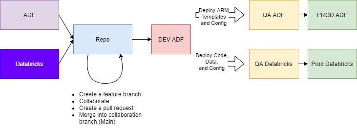
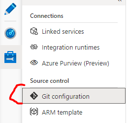
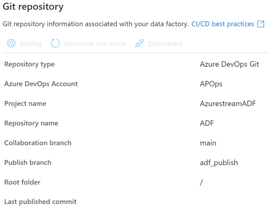
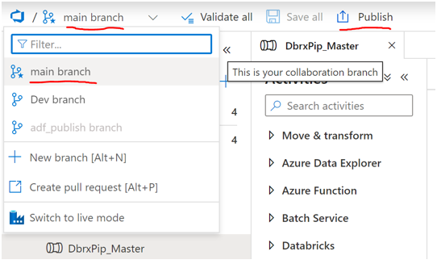
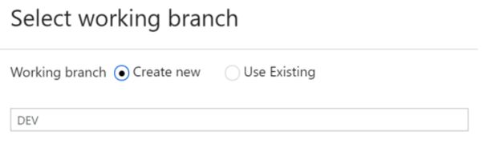
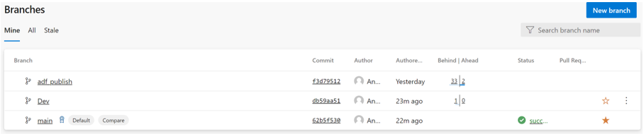
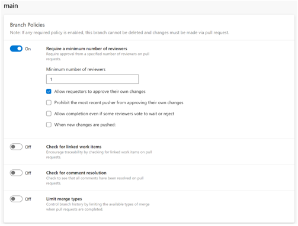
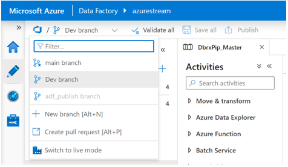

# ADF and Databricks DevOps

A DevOPs guide for ADF and Databricks.

Reference:
- [CO/CD ADF](https://docs.microsoft.com/en-us/azure/data-factory/continuous-integration-deployment)

## Diagram

## ADO Source Control Configuration

- [Source control for ADF](https://docs.microsoft.com/en-us/azure/data-factory/source-control)
- [Source control for Databricks](https://docs.microsoft.com/en-us/azure/databricks/notebooks/azure-devops-services-version-control)

### Creating or modifying an ADF pipeline with a Databricks notebook in the Dev Environment

- One of the developers creates a feature branch from ADF or Databricks
- Have the Data Bricks checout the brand and work on the notebook and data
- Have the ADF developer checkout the same feature branch from the repo and work on the ADF pipeline
- Collaborate to create the pipeline with the Databricks notebook
- Once tested, one of the developers should submit the pull request
- Upon approval both the ADF json and Databricks code is merged into main
- In ADF, publish the pipeline

> Note: parametarize the ADF pipeline and Databricks so that they can be deployed to different environments

### Configure your ADF Git Repository for Azure DevOps

- [AZURE DATA FACTORY WITH AZURE DEVOPS](https://azure.microsoft.com/mediahandler/files/resourcefiles/whitepaper-adf-on-azuredevops/Azure%20data%20Factory-Whitepaper-DevOps.pdf)

1. Open the Git configuration in ADF

     

2. Configure your Git Repository so you end up with the below setup

     

3. Your Collaboration branch should be named either ***main*** or ***master*** branch. 

     By default, ADF names it ***`main`***

4. Your Publish Branch is by default named ***`adf_publish`*** branch. 

     (This is the branch that has all the ARM templates that ADF uses to build itself and the pipelines, your linked services, triggers and datasets, etc.)

     (Note: This branch will **NOT** appear on the DevOps side **until** you click on the ADF Publish button from the main branch. If you don’t see it right from the start don’t worry, it will appear after you’ve clicked on the publish button inside of ADF.)

     

5. When ADF asks you to select or create a working branch make sure you make a working branch named ***Dev***. Your ***Dev*** branch is where you will make all your changes. Each developer must create a ***Feature*** branch or a ***Dev*** branch to create, update and save their pipelines and activities.

     

6. You should end up with a branching structure that looks like this over on your DevOps side:

      

      Remember: The ***adf_publish*** branch will **NOT** appear on the DevOps side until you’ve configured your DevOps connection and clicked on the ADF Publish button from the ***main*** branch inside your ADF.

      Note: You could further protect your ***main*** branch by putting in a branching policy so that the branch for instance needs an approver or a work item ticket before the pull request is fully excepted.

      

7. Finally, on the ADF side you should end up with a branching structure that looks like this:

      

##### Now how does the developer flow go? Well, it goes something like this:

    
   a. You make changes in your ***Dev*** branch. Once development is complete for a specific feature, the developer will save his/her changes and submit a pull request from their ***working*** branch or ***feature*** branch or ***dev*** branch to merge the changes into the ***main*** or ***master*** branch. 

   b. While submitting the pull request, the developer must provide title and detailed description of the changes. (The developer can link the pull request to the associated work items.)

   c. The reviewer, usually the Dev lead or manager, will review all changes and can approve or reject the request. The reviewer can see all the files that have been changed as part of this release/sprint by doing a file comparison before deciding whether to approve or reject.

   d. If the pull request is approved and the changes successfully merged into the ***main/master*** branch, the dev lead can then go back into ADF and point to the ***main*** branch and publish the branch to ADF by clicking on the publish button. (Make sure you are in the main branch because the main branch is the only branch that can publish to ADF). This action will trigger create or update of the ***adf_publish*** branch.
    

## CI/CD to Upper Environment(s)

### ADF

- Generates ARM templates
- Publish and create the artifacts with the ADF ARM templates
- Use a pipeline to deploy the ARM templates to upper environment(s)
  - Modify the parameters accordingly

### Databricks

- Generates code and data files
- Use a pipeline (using the Databricks tools) to push the code required files to the upper environment(s)
  - Modify parameter and data accordingly
