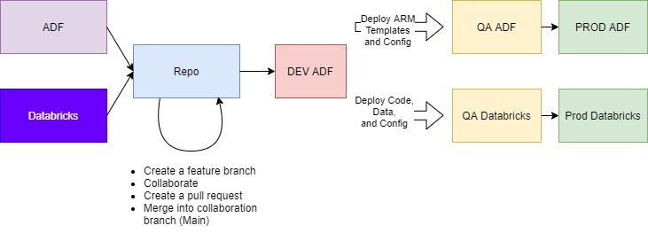

# ADF and Databricks DevOps

A DevOPs guide for ADF and Databricks.

Reference:
- [CO/CD ADF](https://docs.microsoft.com/en-us/azure/data-factory/continuous-integration-deployment)

## Diagram

## ADO Source Control Configuration

- [Source control for ADF](https://docs.microsoft.com/en-us/azure/data-factory/source-control)
- [Source control for Databricks](https://docs.microsoft.com/en-us/azure/databricks/notebooks/azure-devops-services-version-control)

### Creating or modifying an ADF pipeline with a Databricks notebook in the Dev Environment

- One of the developers creates a feature branch from ADF or Databricks
- Have the Data Bricks checout the brand and work on the notebook and data
- Have the ADF developer checkout the same feature branch from the repo and work on the ADF pipeline
- Collaborate to create the pipeline with the Databricks notebook
- Once tested, one of the developers should submit the pull request
- Upon approval both the ADF json and Databricks code is merged into main
- In ADF, publish the pipeline

> Note: parametarize the ADF pipeline and Databricks so that they can be deployed to different environments

## CI/CD to Upper Environment(s)

### ADF

- Generates ARM templates
- Publish and create the artifacts with the ADF ARM templates
- Use a pipeline to deploy the ARM templates to upper environment(s)
  - Modify the parameters accordingly

### Databricks

- Generates code and data files
- Use a pipeline (using the Databricks tools) to push the code required files to the upper environment(s)
  - Modify parameter and data accordingly
